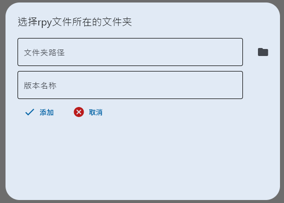

| model           | speed    | bert               | blue                | chrf               | meteor             | ter                 |
|-----------------|----------|--------------------|---------------------|--------------------|--------------------|---------------------|
| T5              | 6.03it/s | 0.6928280250513454 | 0.3236760768569635  | 0.7055104197691929 | 0.5202733889635028 | 0.4786141615251533  |
| mBart           | 8.76it/s | 0.6788185719676336 | 0.30694709857998387 | 0.6898200104557365 | 0.5042506479000791 | 0.4581203773895176  |
| GLM2_fb4_direct | 1.07it/s | 0.6501787317320361 | 0.31949049843210575 | 0.6771792321184925 | 0.5326273110653081 | 0.47008870367536315 |
| GLM2_fb4_chat   | 1.01it/s | 0.6477169000046459 | 0.31573335236516953 | 0.674652569905609  | 0.5248946577622036 | 0.45784398326570624 |
| GLM2_f7         | 1.03s/it | 0.6507797294500224 | 0.3190364317203384  | 0.6772134341965752 | 0.5300153400603933 | 0.4652535067353141  |

| model           | speed    | bert                                        | blue                                        | chrf                                        | meteor                                      | ter                                         |
|-----------------|----------|---------------------------------------------|---------------------------------------------|---------------------------------------------|---------------------------------------------|---------------------------------------------|
| T5              | 6.03it/s | **0.692828** | **0.323676** | **0.705510** | 0.520273                                    | **0.478614** |
| mBart           | 8.76it/s | 0.678819                                    | 0.306947                                    | 0.689820                                    | 0.504251                                    | 0.458120                                    |
| GLM2_fb4_direct | 1.07it/s | 0.650179                                    | 0.319490                                    | 0.677179                                    | **0.532627** | 0.470089                                    |
| GLM2_fb4_chat   | 1.01it/s | 0.647717                                    | 0.315733                                    | 0.674653                                    | 0.524895                                    | 0.457844                                    |
| GLM2_f7         | 1.03s/it | 0.650780                                    | 0.319036                                    | 0.677213                                    | 0.530015                                    | 0.465254                                    |

# Renpy translation manager

---
*基于[`flet`](https://github.com/flet-dev/flet)的`.rpy`人工翻译润色桌面软件,实现创建翻译任务和分配*

## 使用的第三方库项目:

python库:
> [skywind3000 / ECDICT](https://github.com/skywind3000/ECDICT) 

---

## 使用教程

### step 0: 生成目标`.rpy`文件:

1.下载 [Renpy-sdk](https://www.renpy.org/latest.html)

2.将游戏文件夹中`game`文件夹下的文件复制到sdk目录下`tutorial/game`文件夹里,如果`game`文件夹下没有`.rpy`文件只有`.rpyc`文件,请自行搜索`.rpyc`转`.rpy`方法

3.然后启动sdk的`renpy.exe`选择`生成翻译`, `语言:`这一栏中填写`chinese_dl` , 勾选 `为翻译生成空字串` 然后点击`生成翻译`

4.生成成功后,`tutorial/game/tl`中会生成带空字符的`rpy`文件

5.将`rpy`文件转移到一个空文件夹

### step 1: 打开APP, 初始设置

1.用户名: 个人昵称, 用于记录任务的发起和完成

2.自动保存: 进行翻译过程中自动翻译的间隔

3.游戏根目录: renpy游戏所在的绝对路径

4.app_id: 百度翻译api的appid

5.app_key: 百度翻译api的appkey

### step 2: 添加version

选择`step -1`生成的rpy文件

添加后 文件夹下会生成同等数量的`json`文件; 一个`config.json`; 以及一个tasks文件夹

绿色区域会添加一个`version`图标

### step 3: 添加task

双击绿色区域的一个绿色`version`图标, 蓝色区域会出现此`version`下的所有`rpy`和`task`

在`task`栏点击加号

选择文件, 事件, 对话, 并添加描述, 最后点击添加按钮

### step 4: 手动翻译

双击刚才添加的`task`

输入翻译, 翻译栏右侧三个按钮分别为`打开原文件`,`转移提示`,`在线翻译`

最右侧可以查询离线字典, 以及保存到本地文件, 只有保存到本地文件才是真正的保存

### step 4: 转移翻译

转移路径: task => json => rpy

1.翻译界面的`保存到本地文件`将翻译转移到`task`本地文件

2.点击`提交任务`

3.完成的任务会自动勾选, 选择转移的`task`,点击`转移翻译到json`, 翻译会转移到json文件

4.点击蓝色`rpy`文件栏上的菜单栏, 点击 `json到rpy`, 翻译就会转移到rpy文件

至此,一次翻译就完成了